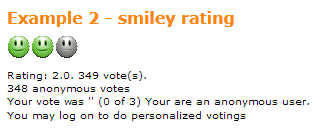
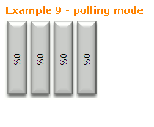

.. ==================================================
.. FOR YOUR INFORMATION
.. --------------------------------------------------
.. -*- coding: utf-8 -*- with BOM.

.. include:: ../Includes.txt

.. _tutorial-examples:

Examples
========

The following gives you an example template configuration how you may use the extension on your website.
You may take this to start using Rating AX and just playing around with the configuration options.

.. only:: html

   .. contents::
        :local:
        :depth: 2

HTML-Template (fileadmin/templates/fullSize.html)
-------------------------------------------------

.. code-block:: html
   :linenos:

   {namespace thr=Thucke\ThRating\ViewHelpers}
   

      

         <h2><f:cObject typoscriptObjectPath="example.7.headerText" /></h2>
         <f:format.raw><f:cObject typoscriptObjectPath="example.7" /></f:format.raw> 
      

   

   

   

      

         <h2>Plain ViewHelperDemo</h2>
         
This rating is included using the Fluid viewhelper of the extension.
         The UID in this example is static regardless which page you select in the frontend.
         It should be easy for you to replace the here choosen static UID with a variable one.

         <thr:rating ratetable="tx_any_table" ratefield="anyField" ratedobjectuid="1" ></thr:rating>
      

   

   

      <h2>Content</h2>
      <f:format.raw>{content}</f:format.raw>
   

CSS-file (fileadmin/templates/fullSize.css)
-------------------------------------------

.. code-block:: css
   :linenos:

   .exampleBlock {
      padding:0px;
      margin:0px;
      line-height:125%;
      font-family:verdana, arial, sans-serif;
      background-color:#FFFF; font-size:0.9em;
   }
   .example {
      padding:20px;
      font-size:1.1em;
   }
   .exampleBlock h2 {
      color:#FF8700;
      font-weight:bold; font-size:1.0em;
      margin-bottom:0.5em; margin-top:1.3em;
      white-space:nowrap;
   }

Typoscript templates
--------------------

The following seperates different template files for better structure.

Main
^^^^

This template must be activated as the root template of your TYPO3 installation.
It should include all other template definitions.

.. code-block:: typoscript
   :linenos:

   #replace this uid with the one on your site
   plugin.tx_felogin_pi1.storagePid = 3

   config {
      no_cache = true
      removeDefaultJS = external
      inlineStyle2TempFile = 1
      meaningfulTempFilePrefix = 100

      sys_language_mode = content_fallback;0
      sys_language_overlay = 1
      # Setting up the language variable "L" to be passed along with links
      linkVars = L

      // configure default language
      sys_language_uid = 2
      language = en
      locale_all = en_GB.utf8
   }

   # German language, sys_language.uid = 1
   [globalVar = GP:L = 1]
   config {
      sys_language_uid = 1
      language = de
      locale_all = de_DE
      htmlTag_langKey = de
      dateFormat = %x
      timeFormat = %X
   }

   # English language, sys_language.uid = 2
   [globalVar = GP:L = 0]
   config {
      sys_language_uid = 2
      locale_all = en_GB
      htmlTag_langKey = en
      language = en
      dateFormat = %x
      timeFormat = %X
   }

   [global]

Page definition
^^^^^^^^^^^^^^^

.. code-block:: typoscript
   :linenos:

   page = PAGE
   page.typeNum = 0
   page.includeCSS.file = fileadmin/templates/fullSize.css

   # Create a Fluid Template
   page.10 = FLUIDTEMPLATE
   page.10 {
      file = fileadmin/templates/fullSize.html
      variables {
         siteName = TEXT
         siteName.value = Ratinx AX examples
         content < styles.content.get
      }
   }

Rating extension
^^^^^^^^^^^^^^^^

Please set ``mapAnonymous`` to a valid frontend user id.

.. code-block:: typoscript
   :linenos:

   plugin.tx_thrating.ratings {
      # adjust default starrating config
      stars < plugin.tx_thrating.ratingConfigurations.stars
       stars {
         settings {
            mapAnonymous = 2
            cookieLifetime = 0
         }
         fluid {
            layouts {
               default {
                  showSummary = 1
               }
            }
            templates {
               ratinglinks.tooltips = 1
            }
         }
      }
      # adjust default barrating config
      barrating < plugin.tx_thrating.ratingConfigurations.barrating
       barrating {
         settings {
            mapAnonymous = 2
            cookieLifetime = 0
         }
         fluid {
            layouts {
               default {
                  showSummary = 1
               }
            }
            templates {
               ratinglinks.tooltips = 1
            }
         }
      }
      # adjust default starsTilt config
      starsTilt < plugin.tx_thrating.ratingConfigurations.starsTilt
       starsTilt {
         settings {
            mapAnonymous = 2
            cookieLifetime = 0
         }
         fluid {
            layouts {
               default {
                  showSummary = 1
               }
            }
            templates {
               ratinglinks.tooltips = 1
            }
         }
      }
      # adjust default facesbartilt config
      facesbartilt < plugin.tx_thrating.ratingConfigurations.facesbartilt
      facesbartilt {
         settings {
            mapAnonymous = 2
            cookieLifetime = 0
         }
         fluid {
            layouts {
               default {
                  showSummary = 1
               }
            }
            templates {
               ratinglinks.tooltips = 1
            }
         }
      }
   }

Example content objects
^^^^^^^^^^^^^^^^^^^^^^^

Please set ``mapAnonymous`` to a valid frontend user id.

.. container::

   ==================================== ============================================
   Example                              Description
   ==================================== ============================================
   :ref:`tutEx1`                        Classic starrating
   :ref:`tutEx2`                        Smiley rating
   :ref:`tutEx3`                        Barrating
   :ref:`tutEx4`                        Vertical classic starrating
   :ref:`tutEx5`                        Current rating (text)
   :ref:`tutEx6`                        Current rating (classic starrating)
   :ref:`tutEx7`                        Vote form
   :ref:`tutEx8`                        Vertical rating
   :ref:`tutEx9`                        Polling mode
   ==================================== ============================================

.. _tutEx1:

Example 1
#########

|example1|

.. code-block:: typoscript
   :linenos:

   example.1 < plugin.tx_thrating
   example.1 {
      headerText = TEXT
      headerText.value = Example 1 - classic starrating
      settings {
         ratetable = tt_content
         ratefield = ratinglinkDemo
         richSnippetFields {
            name = header
            description = bodytext
            url =
         }
         mapAnonymous = 2
         enableReVote = 1
         cookieLifetime = 0
         displayOnly = 0
         display = stars
         foreignFieldArrayUpdate = 0
      }
   }

.. _tutEx2:

Example 2
#########

|example2|

.. code-block:: typoscript
   :linenos:

   example.2 < plugin.tx_thrating
   example.2 {
      headerText = TEXT
      headerText.value = Example 2 - smiley rating
      settings {
         ratetable = tt_content
         ratefield = ratinglinkDemo
         richSnippetFields {
            name = header
            description = bodytext
            url =
         }
         mapAnonymous = 2
         enableReVote = 1
         cookieLifetime = 0
         displayOnly = 0
         display = smiley
         foreignFieldArrayUpdate = 0
      }
   }

.. _tutEx3:

Example 3
#########

|example3|

.. code-block:: typoscript
   :linenos:

   example.3 < plugin.tx_thrating
   example.3 {
      headerText = TEXT
      headerText.value = Example 3 - barrating
      settings {
         ratetable = tt_content
         ratefield = ratinglinkDemo
         richSnippetFields {
            name = header
            description = bodytext
            url =
         }
         mapAnonymous = 2
         enableReVote = 1
         cookieLifetime = 0
         displayOnly = 0
         display = barrating
         foreignFieldArrayUpdate = 0
      }
   }

.. _tutEx4:

Example 4
#########

|example4|

.. code-block:: typoscript
   :linenos:

   example.4 < plugin.tx_thrating
   example.4 {
      headerText = TEXT
      headerText.value = Example 4 - vertical classic starrating
      settings {
         ratetable = tt_content
         ratefield = ratinglinkDemo
         richSnippetFields {
            name = header
            description = bodytext
            url =
         }
         mapAnonymous = 2
         enableReVote = 1
         cookieLifetime = 4
         displayOnly = 0
         display = starsTilt
         foreignFieldArrayUpdate = 0
      }
   }

.. _tutEx5:

Example 5
#########

|example5|

.. code-block:: typoscript
   :linenos:

   example.5 < plugin.tx_thrating
   example.5 {
      action = show
      switchableControllerActions {
         Vote {
            1 = show
         }
      }
      headerText = TEXT
      headerText.value = Example 5 - current rating (text)
      settings {
         ratetable = tt_content
         ratefield = ratinglinkDemo
         richSnippetFields {
            name = header
            description = bodytext
            url =
         }
         fluid {
            layouts.default.showSummary = 1
            partials {
               showTextInfo = 1
               showGraphicInfo = 0
            }
         }
        mapAnonymous = 2
        enableReVote = 0
        cookieLifetime = 0
        displayOnly = 0
        display = stars
        foreignFieldArrayUpdate = 0
        showNotRated = 1
      }
   }

.. _tutEx6:

Example 6
#########

|example6|

.. code-block:: typoscript
   :linenos:

   example.6 < plugin.tx_thrating
   example.6 {
      headerText = TEXT
      headerText.value = Example 6 - current rating (classic starrating)
      settings {
         ratetable = tt_content
         ratefield = ratinglinkDemo
         richSnippetFields {
            name = header
            description = bodytext
            url =
         }
         fluid.partials.showTextInfo = 0
         mapAnonymous = 2
         enableReVote = 1
         cookieLifetime = 0
         displayOnly = 0
         display = stars
         foreignFieldArrayUpdate = 0
      }
   }

.. _tutEx7:

Example 7
#########

|example7|

.. code-block:: typoscript
   :linenos:

   example.7 < plugin.tx_thrating
   example.7 {
      action = new
      switchableControllerActions {
         Vote {
            1 = new
         }
      }
      headerText = TEXT
      headerText.value = Example 7 - vote form
      settings {
         ratetable = tt_content
         ratefield = ratinglinkDemo
         richSnippetFields {
            name = header
            description = bodytext
            url =
         }
         fluid {
         layouts.default.showSummary = 1
         partials {
            showTextInfo = 1
            showGraphicInfo = 0
         }
        }
         mapAnonymous = 2
         enableReVote = 0
         cookieLifetime = 0
         displayOnly = 0
         display = stars
         foreignFieldArrayUpdate = 0
      }
   }

.. _tutEx8:

Example 8
#########

|example8|

.. code-block:: typoscript
   :linenos:

   example.8 < plugin.tx_thrating
   example.8 {
      headerText = TEXT
      headerText.value = Example 8 - vertical rating
      settings {
         ratetable = tt_content
         ratefield = ratinglinkDemo
         richSnippetFields {
            name = header
            description = bodytext
            url =
         }
         mapAnonymous = 2
         enableReVote = 1
         cookieLifetime = 0
         displayOnly = 0
         display = facesbartilt
         foreignFieldArrayUpdate = 0
      }
   }

.. _tutEx9:

Example 9
#########

|example9|

.. code-block:: typoscript
   :linenos:

   example.9 < plugin.tx_thrating
   example.9 {
      action = polling
      switchableControllerActions {
         Vote {
            1 = polling
         }
      }
      headerText = TEXT
      headerText.value = Example 9 - polling mode
      settings {
         ratetable = tt_content
         ratefield = ratinglinkDemo
         richSnippetFields {
            name = header
            description = bodytext
            url =
         }
         mapAnonymous = 2
         cookieLifetime = 0
         displayOnly = 0
         display = polling
      }
   }

.. ==================================================
.. Image definitions
.. --------------------------------------------------

.. |example1| image:: Images/Th_rating_example1.png
   :alt: Example 1 - classic starrating
   :align: top

.. |example3| image:: Images/Th_rating_example3.png
   :alt: Example 3 - vertical classic starrating
   :align: top

.. |example4| image:: Images/Th_rating_example4.png
   :alt: Example 4 - current rating (text)
   :align: top
   :width: 350

.. |example5| image:: Images/Th_rating_example5.png
   :alt: Example 5 - current rating (classic starrating)
   :align: top
   :width: 350

.. |example6| image:: Images/Th_rating_example6.png
   :alt: Example 6 - vote form
   :align: top
   :width: 350

.. |example7| image:: Images/Th_rating_example7.png
   :alt: Example 7 - vertical rating
   :align: top

.. |example8| image:: Images/Th_rating_example8.png
   :alt: Example 8 - polling mode
   :align: top

