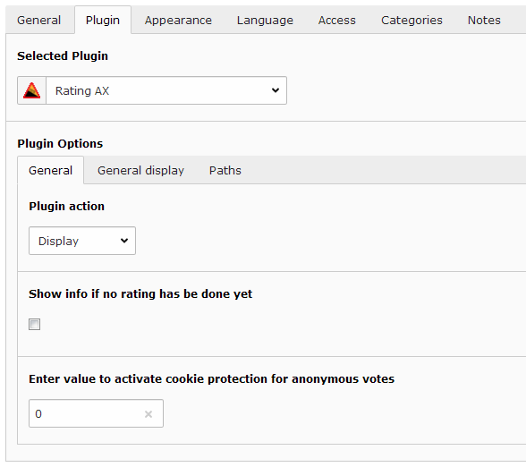
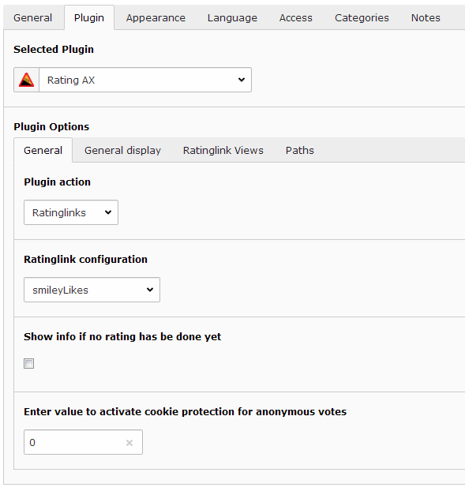
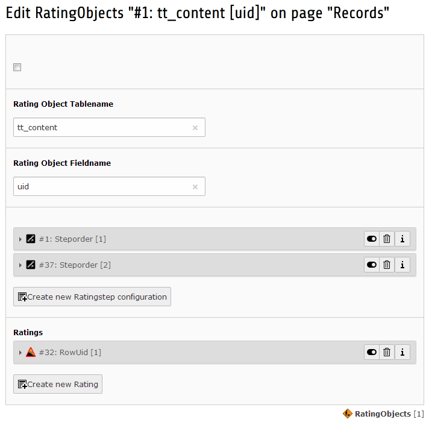

.. ==================================================
.. FOR YOUR INFORMATION
.. --------------------------------------------------
.. -*- coding: utf-8 -*- with BOM.

.. include:: ../Includes.txt

.. _users-manual:

Users manual
------------

This extension does mainly target developers (website administrators and
extension developers) but you can also easily use this rating directly
on pages as a content element.

#. Create a new content element of the type "Insert Plugin"

   |ManualNewContentElement.png|

#. Choose the extension "Rating AX" in the dropdownbox

   |ManualContentElementPlugin.png|

#. Configure your rating

   The concerned ratingobject in that mode uses ``tt_content`` as tablename and ``uid`` as fieldname. You may first configure the ratingsteps you
   like to have. Be aware using ongoing positive integer ratingorder numbers.

   |ManualContentElementObject.png|

   If you are working on multilanguage websites you may add translations of your ratingsteps as usual:

   |ManualRatingstepMultilang.png|

   Important: Don´t forget adding the additional language you want to add to the list of pagelanguages in your storagepage.

.. _faq:

FAQ
~~~

-  Nothing so far

.. ==================================================
.. Image definitions
.. --------------------------------------------------

.. |ManualRatingstepMultilang.png|    image:: ManualRatingstepMultilang.png
   :alt: Edit ratingstep names (multilingual)
   :align: top
   :width: 450

